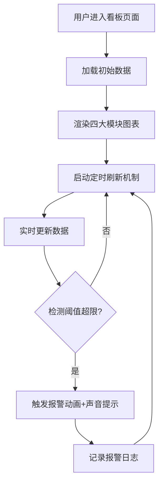

## 1. 产品概述

工地现场可视化看板是一款面向建筑工程项目管理的实时数据可视化平台，通过直观的图表和仪表盘展示工地现场的关键指标，帮助项目管理者实时掌握工程进度、人员分布、安全状况和环境质量。

- 核心目标：提升工地管理效率，降低安全风险，实现数字化、可视化的智慧工地管理
- 目标用户：项目经理、安全总监、施工负责人、监理人员
- 核心价值：一屏统览工地全局，实时预警风险隐患，辅助决策管理

## 2. 核心功能

### 2.1 用户角色

| 角色 | 登录方式 | 核心权限 |
|------|----------|----------|
| 项目管理者 | 账号密码登录 | 查看全部数据、配置预警阈值、导出报表 |
| 监理人员 | 账号密码登录 | 查看进度、安全、环境数据 |

### 2.2 功能模块

1. **项目进度甘特图**：展示各工序计划时间线与实际完成线，颜色标识进度状态
2. **施工人员定位**：按标段展示各班组出勤人数和分布区域
3. **重大危险源监控**：塔吊运行参数实时显示，超限自动报警
4. **环境监测**：PM2.5、噪声、扬尘实时数据，超标预警联动喷淋

### 2.3 页面详情

| 页面名称 | 模块名称 | 功能描述 |
|----------|----------|----------|
| 可视化看板主页 | 顶部标题栏 | 项目名称、当前时间、天气信息、报警统计 |
| 可视化看板主页 | 项目进度甘特图 | 横道图展示各工序计划/实际时间，颜色区分进度状态（绿/黄/红） |
| 可视化看板主页 | 施工人员定位 | 区域分布图、班组出勤统计、人员数量趋势 |
| 可视化看板主页 | 重大危险源监控 | 塔吊参数仪表盘、报警记录、实时状态指示 |
| 可视化看板主页 | 环境监测 | 实时数据卡片、趋势曲线图、喷淋状态指示 |

## 3. 核心流程

## 4. 用户界面设计

### 4.1 设计风格

- **主色调**：深蓝色（#0A1628）作为背景主色，营造专业科技感
- **强调色**：
  - 正常状态：绿色（#00E676）
  - 预警状态：黄色（#FFD600）
  - 报警状态：红色（#FF1744）
  - 信息色：蓝色（#00B0FF）
- **字体**：使用 Orbitron（数字显示）+ Noto Sans SC（中文正文）
- **布局风格**：网格化卡片布局，深色背景配发光边框，科技感十足
- **视觉效果**：渐变背景、玻璃拟态卡片、数据发光效果、脉冲动画

### 4.2 页面设计概览

| 页面名称 | 模块名称 | UI元素 |
|----------|----------|--------|
| 可视化看板主页 | 顶部标题栏 | 项目名称大字、实时时钟、天气图标、报警徽章 |
| 可视化看板主页 | 进度甘特图 | 横向条形图、双时间线对比、颜色状态标识、图例 |
| 可视化看板主页 | 人员定位 | 区域地图示意图、班组人数柱状图、人员总数统计 |
| 可视化看板主页 | 危险源监控 | 仪表盘（吊重/风速/角度）、状态指示灯、报警列表 |
| 可视化看板主页 | 环境监测 | 数据卡片、折线趋势图、喷淋开关状态 |

### 4.3 响应式

- 桌面端优先设计，适配1920×1080及以上分辨率
- 支持缩放自适应，保持布局完整性
- 大屏展示优化，适合指挥中心大屏显示

### 4.4 动效设计

- 数据加载时的淡入动画
- 数值变化的平滑过渡
- 报警时的红色脉冲闪烁
- 图表切换的平滑过渡
- 背景网格流动效果
