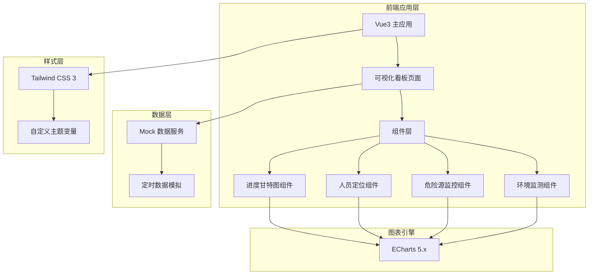

## 1. 架构设计



## 2. 技术选型说明

- **前端框架**: Vue 3 + Composition API + TypeScript
- **构建工具**: Vite 5.x
- **图表库**: ECharts 5.x
- **样式方案**: Tailwind CSS 3
- **路由**: Vue Router 4
- **状态管理**: Vue Composition API (reactive/ref)
- **数据模拟**: 前端 Mock 数据 + 定时刷新模拟

## 3. 项目结构

```
src/
├── components/          # 可复用组件
│   ├── charts/         # 图表组件
│   │   ├── GanttChart.vue      # 甘特图组件
│   │   ├── PersonnelMap.vue    # 人员定位图
│   │   ├── TowerCraneGauge.vue # 塔吊仪表盘
│   │   └── EnvTrendChart.vue   # 环境趋势图
│   └── common/         # 通用组件
│       ├── DataCard.vue        # 数据卡片
│       ├── AlarmBadge.vue      # 报警徽章
│       └── StatusIndicator.vue # 状态指示器
├── composables/        # 组合式函数
│   ├── useInterval.ts         # 定时器hook
│   ├── useECharts.ts          # ECharts封装
│   └── useMockData.ts         # Mock数据生成
├── pages/              # 页面
│   └── Dashboard.vue          # 可视化看板主页
├── router/             # 路由配置
│   └── index.ts
├── styles/             # 全局样式
│   └── index.css
├── types/              # 类型定义
│   └── index.ts
├── utils/              # 工具函数
│   └── index.ts
├── App.vue
└── main.ts
```

## 4. 路由定义

| 路由路径 | 页面名称 | 说明 |
|----------|----------|------|
| / | 可视化看板 | 工地现场可视化看板主页 |
| /dashboard | 可视化看板 | 重定向到 / |

## 5. 数据模型

### 5.1 项目进度数据

```typescript
interface ProjectTask {
  id: string;
  name: string;           // 工序名称
  planStart: string;      // 计划开始日期
  planEnd: string;        // 计划结束日期
  actualStart: string;    // 实际开始日期
  actualEnd: string;      // 实际结束日期
  progress: number;       // 完成进度百分比
  status: 'normal' | 'warning' | 'danger'; // 进度状态
}
```

### 5.2 施工人员数据

```typescript
interface TeamPersonnel {
  team: string;           // 班组名称
  count: number;          // 出勤人数
  area: string;           // 所在区域
  color: string;          // 标识颜色
}

interface PersonnelData {
  total: number;          // 总人数
  teams: TeamPersonnel[]; // 各班组数据
  areas: AreaData[];      // 各区域数据
  trend: TimePoint[];     // 趋势数据
}
```

### 5.3 塔吊监控数据

```typescript
interface TowerCraneData {
  id: string;
  name: string;           // 塔吊编号
  load: number;           // 当前吊重 (吨)
  maxLoad: number;        // 额定吊重
  windSpeed: number;      // 风速 (m/s)
  maxWindSpeed: number;   // 最大允许风速
  angle: number;          // 回转角度 (度)
  height: number;         // 起升高度 (米)
  status: 'normal' | 'warning' | 'danger';
  alarms: AlarmRecord[];  // 报警记录
}

interface AlarmRecord {
  id: string;
  time: string;
  type: string;
  level: 'warning' | 'danger';
  message: string;
}
```

### 5.4 环境监测数据

```typescript
interface EnvData {
  pm25: number;           // PM2.5 (μg/m³)
  pm10: number;           // PM10 (μg/m³)
  noise: number;          // 噪声 (dB)
  temperature: number;    // 温度 (℃)
  humidity: number;       // 湿度 (%)
  sprinklerOn: boolean;   // 喷淋状态
  trend: EnvTrendPoint[]; // 趋势数据
}

interface EnvTrendPoint {
  time: string;
  pm25: number;
  pm10: number;
  noise: number;
}
```

## 6. 核心功能实现方案

### 6.1 甘特图实现
- 使用 ECharts 自定义系列实现双时间线甘特图
- 条形图颜色根据进度状态动态变化
- 支持计划与实际时间线对比显示

### 6.2 人员定位实现
- 使用 ECharts 散点图 + 地理区域划分展示人员分布
- 柱状图展示各班组人数统计
- 数字滚动动画展示实时人数

### 6.3 塔吊监控实现
- 使用 ECharts 仪表盘组件展示吊重、风速、角度
- 实时数据刷新动画
- 报警状态闪烁效果

### 6.4 环境监测实现
- 数据卡片展示实时数值
- ECharts 折线图展示趋势
- 超标时喷淋状态自动切换

## 7. 性能优化

- ECharts 实例复用与防抖 resize
- 定时刷新数据节流控制
- 组件懒加载（按需引入）
- CSS 变量与主题切换优化
